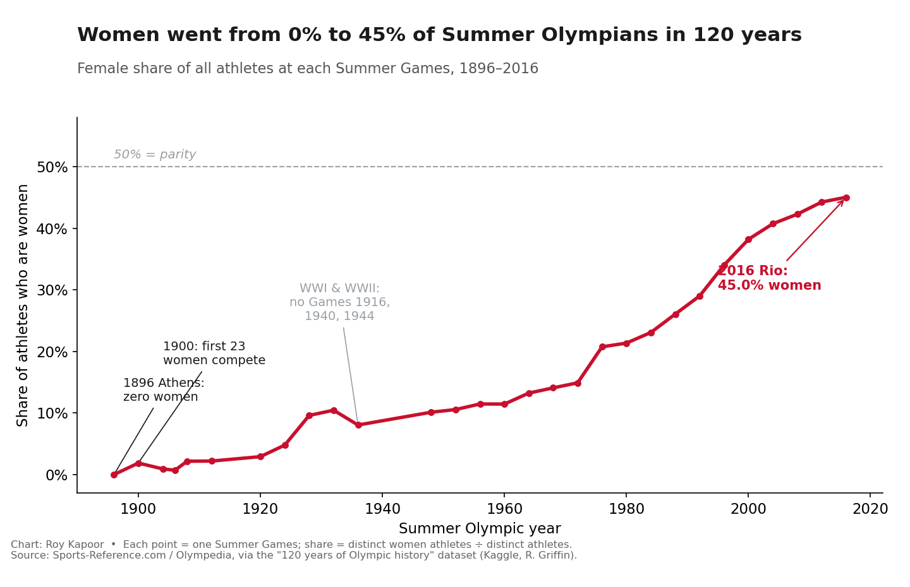
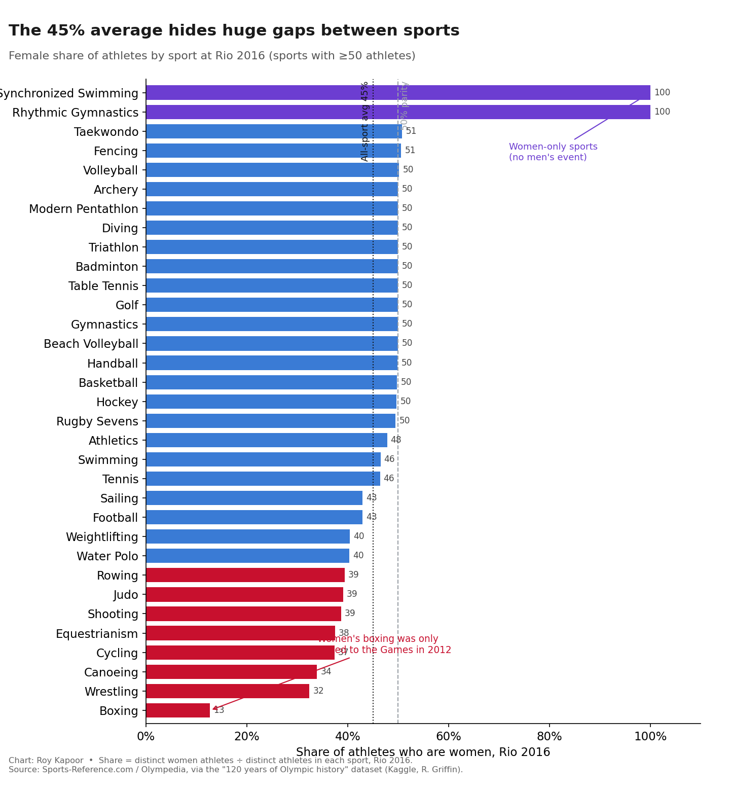

# It took 120 years for women to go from 0% to 45% of Summer Olympians — and that average still hides where they're missing

*A JOURN 124 data story by Roy Kapoor*

When the first modern Olympic Games opened in Athens in 1896, not a single woman competed. One hundred and twenty years later, at Rio 2016, women made up **45% of all athletes** — the closest the Summer Games have ever come to parity. This project traces that long climb using athlete-level records from every Summer Games between 1896 and 2016, and then asks a sharper question: does that single 45% number actually mean the Olympics are nearly equal? The data says no. The average hides sports where women are still scarce, sports that are women-only, and countries that sent their first female athlete as recently as 2012.

## Where the data comes from, and what to question about it

The dataset is **"120 years of Olympic history: athletes and results,"** a table of 271,116 rows in which each row is one athlete competing in one event. The columns include the athlete's ID, name, sex, age, height, weight, country (NOC), sport, event, year, season, and medal.

The data was published on [Kaggle](https://www.kaggle.com/heesoo37/120-years-of-olympic-history-athletes-and-results) by data scientist Randi H. Griffin, but **Kaggle is not the original source.** Griffin scraped the records from **Sports-Reference.com**, whose Olympic statistics section was built on the historical archive now maintained by **Olympedia** and the volunteer researchers of the International Society of Olympic Historians. So the real origin is a community of sports historians compiling results from official Olympic reports — not the IOC publishing a clean file.

That provenance matters for trust. A few things to be skeptical about:

- **It is second-hand.** A journalist publishing this for real would spot-check a sample of athletes against official IOC results or Olympedia directly, because scraping and re-hosting can introduce errors.
- **The records get thinner the further back you go.** Height and weight are missing for about 22–23% of all rows, concentrated in the early 1900s, so I deliberately built the story on `Sex`, `Year`, and `Sport`, which are 100% complete.
- **"Sex" here is a binary field** recorded by historical sources, not a self-identification. It cannot represent intersex or transgender athletes, and it reflects how officials of each era classified competitors.
- **It stops at 2016.** Tokyo 2020 (held in 2021) and Paris 2024 are not included, so this is history, not the present.

A good journalist is willing to be disappointed by the truth — and here the disappointment is that "45%" is not the same as "equal."

## The analysis

I did the analysis two ways so it can be checked: a **Google Sheet** built with pivot tables, and a fully commented **Python notebook** in this repo ([`olympics_analysis.ipynb`](olympics_analysis.ipynb)).

➡️ **Google Sheet (pivot tables and cleaning):** [View the analysis in Google Sheets](https://docs.google.com/spreadsheets/d/1DJf0e125npFOmwpMu4gFVEb1boTcip4vlYqmAqLp96I/edit?usp=sharing)

The most important cleaning decision: because one athlete appears once per *event*, counting rows would over-count people who entered several events. So I counted **distinct athlete IDs** per Games instead of rows. I also limited the time line to the **Summer Games**, which run continuously from 1896; the Winter Games only began in 1924 and would distort a single trend line. In the Google Sheet, the same result comes from a pivot table with **Year** as rows, **Sex** as columns, and a **COUNT** of athletes as the value, then a formula for the female share. The cleaned, pivot-ready file is in [`data/olympics_summer_athletes_clean.csv`](data/olympics_summer_athletes_clean.csv).

Three findings came out of it:

1. The female share of Summer Olympians rose from **0% (1896)** to **45% (2016)**, passing 10% only in the 1930s and 25% only in 1988.
2. That 45% average hides a wide spread by sport — from **12.7%** in boxing to **100%** in two women-only sports.
3. Full national inclusion is very recent: **Saudi Arabia, Qatar, and Brunei** each sent their first woman to the Summer Games only in **2012**.

## Chart 1: The long climb to (near) parity

*The female share of athletes at each Summer Games, 1896–2016. Each point is one Games; the share is distinct women athletes divided by all distinct athletes. The dashed line marks 50% parity, which the Games have never reached. Gaps reflect the 1916, 1940, and 1944 Games cancelled by the World Wars. Chart by Roy Kapoor. Source: Sports-Reference.com / Olympedia, via the "120 years of Olympic history" dataset (Kaggle, R. Griffin).*

A line chart is the right tool here because the question is about change over a continuous time line. The shape tells the story a paragraph cannot: near-zero for decades, a slow rise through the mid-century, then a steep climb after 1976 as more women's events were added.

## Chart 2: The average hides where women are still missing

*Female share of athletes by sport at Rio 2016, for sports with at least 50 athletes. Boxing was the least balanced at 12.7% (women's boxing was only added in 2012); two women-only sports sit at 100%; most others cluster near the 50% parity line. Chart by Roy Kapoor. Source: Sports-Reference.com / Olympedia, via the "120 years of Olympic history" dataset (Kaggle, R. Griffin).*

A bar chart is appropriate because this compares separate categories (sports) rather than a trend. Sorting the bars makes the spread obvious and shows that the headline "45%" is a blend of sports at very different stages — exactly the kind of nuance an average can erase.

## Summary, ethics, and what reporting would come next

The clean version of this story is that the Summer Olympics moved from total exclusion of women to near-parity in a century — a genuinely large change. The honest version is more complicated. A 45% average is built from boxing at 12.7%, a cluster of sports at roughly 50%, and a couple of women-only sports at 100% that mathematically pull the average up without representing "equality" in any normal sense. Counting bodies is not the same as measuring fairness.

**Ethical concerns.** The biggest risk is misreading what the numbers describe. "Share of athletes who are women" is a measure of *participation*, not of pay, media coverage, coaching, prize money, or governance — areas where gaps are often much wider than 45-vs-55. Presenting the parity story without that caveat could let institutions claim a level of equality the data does not actually support. There's also a representation concern: the `Sex` field is a historical binary recorded by officials, so this analysis cannot speak to intersex or transgender athletes, and it should not be stretched to do so. Finally, country-level findings (such as nations that excluded women until 2012) should be reported as facts in the record, not as a tool to single out or stereotype particular cultures, since exclusion of women from sport has been near-universal historically.

**What additional reporting this story needs.** To be complete and fair, I would: (1) verify a sample of the scraped records against Olympedia or official IOC reports to confirm the data's integrity; (2) extend the analysis through Tokyo 2020 and Paris 2024, since the IOC reported Paris as the first "gender-equal" Games by quota — a claim worth testing against the actual athlete counts; (3) separate *events open to women* from *athletes who competed*, because the IOC controls the first directly; and (4) interview Olympic historians and athletes to explain the inflection points the chart reveals, especially the post-1976 surge. The data can show *that* the gap narrowed and *where* it remains; reporting is what would explain *why*.

---

### Files in this repository
- **`README.md`** — this data story
- **`olympics_analysis.ipynb`** — commented Python notebook reproducing every step and both charts
- **`charts/`** — the two chart images
- **`data/olympics_summer_athletes_clean.csv`** — cleaned, pivot-ready data (Summer Games, one row per athlete per Games)
- **`HOW_TO_SUBMIT.md`** — how to build the Google Sheet pivots and post this repo to GitHub

### Data source
**120 years of Olympic history: athletes and results** — Randi H. Griffin, Kaggle (2018), scraped from Sports-Reference.com / Olympedia.
<https://www.kaggle.com/heesoo37/120-years-of-olympic-history-athletes-and-results>
